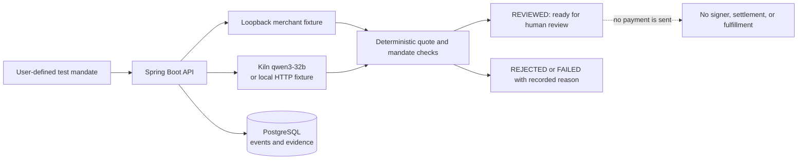

<div align="center">

# 🌊 Floww Server

### AI can make the move. Your rules set the limits.

**A backend for bounded, reviewable AI-assisted purchases.**

<p>
  
  
  
  
</p>

<p><em>Clear scope. Deliberate decisions. A clean paper trail.</em></p>

</div>

---

The [`/api/v1/tasks` Task API](docs/TASK_API_KO_EN.md) persists versioned mandates and deterministic three-pharmacy simulator results in PostgreSQL (Flyway V4). It can create simulated merchant orders but makes no payment; `paymentStatus` remains `NOT_ATTEMPTED`. The [AI Task proposal endpoint](docs/AI_TASK_INTEGRATION_KO_EN.md) is request-driven and proposes through the existing policy boundary; it grants no spending authority.

The `dev` profile uses local bearer tokens; default and `vercel` validate issued JWTs. [Wallet sign-in](docs/WALLET_SIGNIN_KO_EN.md) is opt-in. The [Vercel/Supabase deployment record](docs/VERCEL_SUPABASE_DEPLOY_KO_EN.md) distinguishes a protected Preview from a public demo or payment/fulfillment proof. Flyway V4 was applied additively to the dedicated Supabase demo database, not a populated production database. F002 prior work and AI coding assistance are disclosed in the demo guide; no PAIVERA implementation was copied.

## ✨ The Floww idea

AI should be able to help with a task without receiving a blank check. Floww is built around a simple boundary:

> **AI proposes. Deterministic policy checks. The user stays in control.**

The current execution slice connects a test mandate, merchant quote, policy result, and execution evidence. That makes it easier to see what was proposed, what passed review, and what still needs a human decision.

## 🧪 What this server does today

The repository contains several useful backend slices at different maturity levels:

- **Legacy execution API** — persists an owner-bound, explicitly confirmed *test mandate*, runs a bounded Kiln/tool conversation against a configured loopback merchant fixture, and records policy and model evidence.
- **AI draft endpoint** — `POST /api/ai/drafts` returns clarification questions or a structured model proposal. `READY_FOR_REVIEW` means the proposal is structurally complete; it is **not** user approval or spending authority.
- **AI Task proposal integration** — `POST /api/v1/tasks/{taskId}/ai-proposal` reads the authenticated owner’s persisted DRAFT mandate and quotes, calls Kiln outside the Task lock, and submits a fresh recommendation to the existing deterministic policy service. See the [integration contract](docs/AI_TASK_INTEGRATION_KO_EN.md). A proposal does not approve or execute a payment.
- **Optional wallet sign-in** — an opt-in SIWE-style EOA sign-in path issues the existing client JWT. Wallet sign-in proves account control; it does not approve a purchase.
- **Persistence and evidence** — PostgreSQL-backed records, Flyway migrations, owner-scoped reads, bounded event history, and evidence export.

### 🚧 Be precise about the boundary

This is an integration-stage backend, not a live purchasing service. The current `REVIEWED` state means a **local quote policy precheck passed**. The repository does not yet provide a live merchant purchase, spending-authority signer, transaction broadcast, payment settlement, or fulfillment verification. A local fixture run or model proposal must not be presented as proof of payment or delivery.

## 🌀 Current legacy flow



The AI can choose only from server-provided offers and quotes. The server rechecks the stored quote and mandate before marking a run `REVIEWED`. Tool calls, provider provenance, usage, and policy outcomes are recorded without treating model text as authorization.

## ⚡ Quick start

### Requirements

- Java 21
- Docker Engine and Docker Compose
- Python 3 for the local merchant and Kiln HTTP fixtures

### Build

With Java 21 and the local PostgreSQL configuration from the runbook:

```bash
./mvnw -B verify
```

### Run the local end-to-end fixture flow

The full walkthrough covers local environment setup, PostgreSQL, the merchant fixture, the Kiln fixture, the server, and the smoke client:

- [Local API contract and runbook](docs/API_CONTRACT.md)
- [Container/PostgreSQL runtime guide](docs/CONTAINER_RUNTIME_KO_EN.md)
- [Technical demo walkthrough](docs/TECHNICAL_DEMO.md)

The Compose database binds to loopback and uses `pull_policy: never`. On a clean machine, pull the pinned database image before starting Compose:

```bash
docker pull postgres:16.4-alpine
```

Never commit `.env`, real API keys, wallet secrets, or private keys. Use [`.env.example`](.env.example) for variable names and keep credentials in a protected local environment.

## 🔌 API map

| Route | What it does | What it does **not** mean |
| --- | --- | --- |
| `GET /actuator/health` | Process and database health | Kiln reachability or payment readiness |
| `GET /api/integrations/readiness` | Reports whether provider/fixture settings exist | A successful provider call or a funded wallet |
| `POST /api/ai/drafts` | Returns clarification questions or a descriptive AI proposal | Approval, verified eligibility, or executable authority |
| `POST /api/executions` + `POST /api/executions/{id}/run` | Runs the legacy local quote-policy flow | A purchase, payment, or delivery |
| `GET /api/executions/{id}/evidence.json` | Exports persisted execution evidence | Proof of an on-chain transaction |

See the [API handoff](docs/API_HANDOFF_KO_EN.md) and [OpenAPI 3.0.3 specification](docs/openapi.json) for request/response shapes, authentication, errors, and pagination.

## 🛡️ Trust boundaries

- **The model is a proposer, not an authority.** It cannot change the server-owned mandate, quote price, recipient, or expiry.
- **Policy checks are deterministic.** Scope, item, recipient, currency, quote freshness, full cost, and deadline are checked outside the model.
- **Unknown stays unknown.** An uncertain payment result must be reconciled before any retry; this repository currently has no live payment path.
- **Evidence is explicit.** Local fixtures, live Kiln calls, testnet transactions, and fulfillment checks are separate kinds of evidence.
- **Credentials stay server-side.** Development bearer tokens and Kiln keys must never be exposed to browser code or committed.

## 🧰 Stack

| Layer | Choice |
| --- | --- |
| Runtime | Java 21 |
| Web/API | Spring Boot 3.5.16 |
| Persistence | PostgreSQL 16.4, Spring JDBC |
| Schema changes | Flyway |
| AI provider integration | Kiln, fixed model `qwen3-32b` |
| Chain utilities | Web3j crypto (wallet sign-in support) |
| Local verification | JUnit, PostgreSQL, and loopback HTTP fixtures |

## 🗂️ Where to look

```text
src/main/java/com/floww/server/
├── aidraft/          # Stateless AI draft endpoint and review preflight
├── aiproposal/       # Owner-JWT Task proposal endpoint and policy adapter
├── auth/             # Email auth, JWT, and optional wallet sign-in
├── execution/        # Legacy execution and local policy-precheck API
├── integration/      # Kiln and loopback merchant adapters
├── payment/          # Future payment/fact ports; no live implementation
└── common/            # Shared auth filters and error handling

src/main/resources/db/migration/  # Flyway schema history
docs/                              # API contracts, handoffs, demos, evidence
scripts/                           # Smoke and fixture evaluation helpers
```

## 📚 Docs & evidence

- [API handoff](docs/API_HANDOFF_KO_EN.md) — current route inventory and integration boundaries
- [AI draft contract](docs/AI_DRAFT_CONTRACT.md) — proposal schema and clarification behavior
- [AI draft HTTP guide](docs/AI_DRAFT_HTTP.md) — request/response and frontend handoff
- [Merchant proposal guide](docs/AI_MERCHANT_PROPOSAL_KO_EN.md) — Java component contract and live-call evidence limits
- [Wallet sign-in guide](docs/WALLET_SIGNIN_KO_EN.md) — optional wallet authentication flow
- [Review confirmation binding](docs/REVIEW_CONFIRMATION_BINDING.md) — exact-draft binding helper; not payment authorization
- [Evidence index](docs/evidence/) — sanitized verification records and their stated scope

## 🎨 Floww palette

<p>
  
  
  
</p>

<div align="center">

**Less autopilot. More intention. Let good decisions flow.** 💙💛

</div>

## Selected-purchase TaskAccount integration

The optional Sepolia TaskAccount path connects a persisted Task and selected quote to owner approval, exact payment and verified simulated fulfillment. See the [API and configuration guide](docs/TASKACCOUNT_E2E_KO_EN.md) and [independent public-Sepolia evidence](docs/F031_INDEPENDENT_SEPOLIA.md). Enable it explicitly with `FLOWW_TASKACCOUNT_ENABLED=true`; the frontend must use the account approval sequence in that mode.
