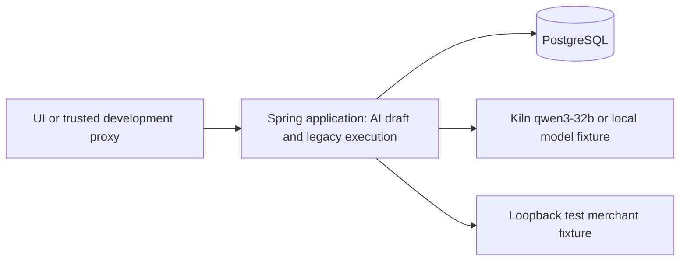

# F011 API integration handoff / API 연동 인계

**Scope / 범위:** This specifies the existing AI integration/preliminary verification code and its neighboring implemented routes. It is not a final product API design for the whole service. / 이 문서는 이미 구현된 AI 연동·사전 검증 코드와 인접 경로의 명세입니다. 서비스 전체의 최종 제품 API 설계안이 아닙니다.

**Source / 기준:** `Floww_Server` upstream main `2de6e4191798cca6a10609b557be09a1fcf614a6` (2026-09-29; PR #14 common errors, PR #15 Java packages), integrated locally for F015. [Importable OpenAPI 3.0.3](openapi.json) describes the implemented routes. Every JSON example below is illustrative test data, not a captured production response. Architecture page 11927569 v11 and vision page 12746767 v6 are proposal context, not team API acceptance. / 아래 JSON은 설명용 테스트 데이터이며 아키텍처·비전 문서는 제안 맥락일 뿐 팀 승인 API가 아닙니다.

## What runs / 실제 구성

One Java 21 / Spring Boot 3.5.16 application process contains the AI draft and execution modules; PostgreSQL 16.4 is a separate database. Persistence uses Spring JDBC (`JdbcTemplate`) and startup `schema.sql`, not JPA. Development bearer identity is a servlet filter, not Spring Security, Magic login, or wallet authentication. No separately deployed microservices, Python API service, chain signer, or payment adapter exist. / 하나의 Java 애플리케이션 프로세스에 초안 및 실행 모듈이 있고 PostgreSQL은 별도입니다. 영속성은 JDBC와 시작 시 `schema.sql`을 사용합니다. 인증은 개발용 필터이며 Magic·지갑 인증이 아닙니다.



The frontend candidate is `POST /api/ai/drafts`: it returns clarification questions or a descriptive proposal. `READY_FOR_REVIEW` is structural readiness of model text, not approval or verified eligibility. Do not connect it directly to `POST /api/executions` with `confirmed:true`. The legacy execution API records a local confirmed-mandate fixture and quote-policy evidence; `REVIEWED` is a local precheck, not a completed purchase. F009 review binding is a pure Java helper with no HTTP route. `PaymentGateway` and `AuthoritativeFactPort` have no HTTP callbacks or implementations. / 프런트엔드 후보는 초안 API입니다. 초안의 `READY_FOR_REVIEW`를 기존 `confirmed:true` 실행 API에 바로 연결하면 안 됩니다. F009는 HTTP 경로가 없고 결제·권위 있는 결과 포트도 구현되지 않았습니다.

Source pointers after PR #15 / PR #15 이후 코드 위치: `aidraft/AiDraftHttpController.java` owns F010; `execution/ExecutionController.java` owns `/api/executions`; `integration/kiln/KilnClient.java` and `integration/merchant/MerchantGateway.java` are provider adapters; `common/auth/DevAuthFilter.java` and `common/error/GlobalExceptionHandler.java` own the development auth and common errors; `payment/PaymentGateway.java` and `payment/AuthoritativeFactPort.java` remain unimplemented ports. These paths are beneath `src/main/java/com/floww/server/`. F012–F014 `aiproposal/AiMerchantProposal.java` is a separate Java caller component with no controller wiring. / 초안·실행·연동·공통 오류의 실제 패키지 경계를 반영하며 F012–F014는 연결되지 않은 Java 컴포넌트입니다.

## Authentication and common rules / 인증 및 공통 규칙

`/actuator/health` alone bypasses `common.auth.DevAuthFilter`; every other application route needs `Authorization: Bearer <SERVER_SIDE_DEV_TOKEN>`. Configured distinct tokens of at least 16 characters map to server-side `alice` or `bob`; cross-owner execution IDs return 404. The token is not a browser credential: keep it and `KILN_API_KEY` in a trusted local shell or server-side development proxy, never in `NEXT_PUBLIC_` variables. There is no implemented CORS contract. `/api/ai/drafts` unauthorized responses use its envelope; other route authorization failures use the common error object below. / 헬스를 제외한 경로는 개발용 Bearer 인증이 필요하며 소유자는 서버가 결정합니다. 초안 경로의 인증 오류만 전용 봉투를 유지합니다.

PR #14 maps application and recognized Spring MVC errors outside the F010 draft controller to `common.error.ErrorResponse`: `reasonCode`, backwards-compatible `code`, bilingual `message`, nullable `taskId` and `attemptId`, and `retryable`. `taskId` is the existing execution UUID when the store throws with one; it is null for pre-creation and other errors. `attemptId` is currently null. A bad UUID or nonnumeric parameter is 400 `INVALID_INPUT`; unreadable JSON or a missing request body is 400 `MALFORMED_JSON`; an unknown route is 404 `ROUTE_NOT_FOUND`; an unsupported method is 405 `METHOD_NOT_ALLOWED` with `Allow`; unsupported media type is 415 `UNSUPPORTED_MEDIA_TYPE`; unexpected exceptions are 500 `INTERNAL_ERROR` without internal details. Only the AI draft route enforces strict UTF-8, duplicate/trailing JSON rejection, and a 128 KiB body limit at its own controller boundary. / 초안 외 경로는 공통 오류 객체를 쓰며 알려진 프레임워크 오류도 매핑합니다. 엄격한 본문 제한은 초안 경로 전용입니다.

Illustrative common 404 for an execution ID / 실행 ID 오류 예시:

```json
{
  "reasonCode": "EXECUTION_NOT_FOUND",
  "code": "EXECUTION_NOT_FOUND",
  "message": {"ko": "실행을 찾을 수 없습니다", "en": "Execution not found"},
  "taskId": "11111111-1111-4111-8111-111111111111",
  "attemptId": null,
  "retryable": false
}
```

`POST /api/ai/drafts` keeps its own `ai-draft-http.v1` envelope for mapped responses and authentication, with `Cache-Control: no-store`. An exception escaping that controller can reach common advice; do not assume the draft envelope for an unhandled server failure. / 초안 경로의 명시적 매핑·인증은 전용 봉투이고 처리되지 않은 예외는 공통 핸들러로 갈 수 있습니다.

## Route inventory / 경로 목록

| Method/path | Purpose / 목적 | Maturity / 단계 | Success | App-mapped errors / 앱 매핑 오류 |
| --- | --- | --- | --- | --- |
| `GET /actuator/health` | Process and DB health / 프로세스·DB 상태 | Local operational | 200 `{"status":"UP"}` when healthy | Actuator health may return 503; not integration proof |
| `GET /api/integrations/readiness` | Configuration flags / 설정 여부 | Local operational | 200 readiness object below | 401 `UNAUTHORIZED` |
| `POST /api/ai/drafts` | Model clarification or proposal / 질문·제안 | Frontend candidate, development only | 200 AI envelope below | 400, 401, 413, 415, 502, 503, 504 codes below |
| `POST /api/executions` | Record local confirmed mandate / 로컬 확정 범위 기록 | Legacy fixture | 200 execution object; replay also 200 | 400 `INVALID_INPUT` or `MALFORMED_JSON`, 409 `IDEMPOTENCY_CONFLICT`, 401 |
| `POST /api/executions/{id}/run` | One local merchant/Kiln precheck / 로컬 사전 검사 | Legacy fixture | 200 execution object, including `REJECTED` or `FAILED` terminal state | 404 `EXECUTION_NOT_FOUND`, 409 `ALREADY_RUN` or `NOT_RUNNING`, 401 |
| `GET /api/executions` | Newest owner executions / 최신 목록 | Legacy fixture | 200 **array** of execution objects | 400 `INVALID_LIMIT`, 401 |
| `GET /api/executions/history` | Cursor-paged owner history / 커서 페이지 | Legacy fixture | 200 `HistoryPage` object | 400 `INVALID_LIMIT`, 404 `EXECUTION_NOT_FOUND` for inaccessible `before`, 401 |
| `GET /api/executions/{id}` | Owner detail / 상세 | Legacy fixture | 200 execution object | 404 `EXECUTION_NOT_FOUND`, 401 |
| `GET /api/executions/{id}/events` | Sequence-paged evidence events / 이벤트 | Legacy fixture | 200 `EventPage` object | 400 `INVALID_CURSOR` or `INVALID_LIMIT`, 404, 401 |
| `GET /api/executions/{id}/evidence.json` | Download evidence export / 증거 내보내기 | Legacy fixture | 200 `floww-evidence-2` object and attachment header | 400 `INVALID_CURSOR` or `INVALID_LIMIT`, 404, 401 |

Paths with `{id}` require an execution UUID. Bad UUID or nonnumeric query text is handled by Spring and mapped to the common 400 `INVALID_INPUT`. Query defaults: list/history `limit=50`; history optional `before` UUID; events `after=0`, `limit=50`; export `after=0`, `limit=100`. All limits are 1–100. `after` must be nonnegative. `GET /api/executions` is a bounded array with no cursor. `GET /api/executions/history` sorts by `(created_at,id)` descending; `nextCursor` is the last ID or the incoming `before` on an empty page, and `hasMore` indicates another page. Its `before` must belong to the same owner. Event `nextCursor` is the last sequence or incoming `after` on an empty page. / 목록은 배열이고 히스토리는 별도 페이지 객체입니다. 잘못된 UUID는 공통 400 오류로 응답합니다.

## AI draft request and responses / 초안 요청·응답

`Content-Type: application/json` with absent or UTF-8 charset is required. Body is at most 131,072 bytes, including chunked transfer. It must be one JSON object containing only `conversation`. There are 1–12 turns, exactly `role` and `content` per turn; roles are `user` or `assistant`, the last is `user`, content is nonblank and at most 4,000 Java characters per turn and 16,000 total. There is **no idempotency key** for this route; an HTTP retry may incur another model call. / 본문은 대화 필드만 허용하고 재시도 시 별도 모델 호출 비용이 발생할 수 있습니다.

```http
POST /api/ai/drafts
Authorization: Bearer <SERVER_SIDE_DEV_TOKEN>
Content-Type: application/json

{
  "conversation": [
    {
      "role": "user",
      "content": "Please draft a scope for one specified paperback. My all-fee maximum is 60 USD; use an authorized bookstore and finish by 2099-01-01T00:00:00Z."
    }
  ]
}
```

Illustrative 200 reviewable response / 검토 가능 응답 예시:

```json
{
  "httpContractVersion": "ai-draft-http.v1",
  "status": "READY_FOR_REVIEW",
  "draft": {
    "schemaVersion": "ai-draft.v1",
    "objective": "Get one paperback delivered",
    "itemScope": "One specified paperback",
    "providerCriteria": "Authorized bookstore",
    "maximumTotalCost": {
      "amount": "60",
      "asset": "USD",
      "includesAllUserPaidFees": true
    },
    "deadline": "2099-01-01T00:00:00Z",
    "fulfillmentCriterion": "Delivery recorded at the specified address"
  },
  "issues": [],
  "evidence": {
    "modelId": "qwen3-32b",
    "modelEvidenceMode": "local_model_fixture",
    "toolCallId": "fixture-call",
    "generationId": "fixture-generation",
    "usageStatus": "reported",
    "usage": {
      "prompt_tokens": 8,
      "completion_tokens": 6,
      "total_tokens": 14
    },
    "cost": null,
    "attempts": 1
  },
  "error": null
}
```

Illustrative 200 clarification response / 추가 질문 응답 예시:

```json
{
  "httpContractVersion": "ai-draft-http.v1",
  "status": "NEEDS_CLARIFICATION",
  "draft": {
    "schemaVersion": "ai-draft.v1",
    "objective": "Get one paperback delivered",
    "itemScope": "One specified paperback",
    "providerCriteria": "Authorized bookstore",
    "maximumTotalCost": null,
    "deadline": "2099-01-01T00:00:00Z",
    "fulfillmentCriterion": "Delivery recorded at the specified address"
  },
  "issues": [
    {
      "code": "COST_MISSING",
      "field": "maximumTotalCost",
      "question": "What is the maximum total you will pay, in which asset, including every fee charged to you?"
    }
  ],
  "evidence": {
    "modelId": "qwen3-32b",
    "modelEvidenceMode": "local_model_fixture",
    "toolCallId": "fixture-call",
    "generationId": "fixture-generation",
    "usageStatus": "reported",
    "usage": {
      "prompt_tokens": 8,
      "completion_tokens": 6,
      "total_tokens": 14
    },
    "cost": null,
    "attempts": 1
  },
  "error": null
}
```

The model can omit unresolved draft fields; missing, `null`, or blank amount/asset values can remain unresolved in `NEEDS_CLARIFICATION`, never inferred as approval. `READY_FOR_REVIEW` requires a present, exact positive decimal `maximumTotalCost.amount` **string** (up to 18 fractional digits), a present asset, all user-paid fees included, and the other structurally complete fields. The `asset` is a model-proposed label, not the legacy `TEST_USDC` restriction. Deadline must be an absolute future offset date-time for structural readiness; relative dates need trusted context. `issues[].question` can be null for structural errors, but model-invalid proposals return 502 instead of draft issues. Provenance fields can be null; `cost` is only provider-reported, never estimated. `modelEvidenceMode` is `kiln` only for exact configured official endpoint, `local_model_fixture` for loopback, otherwise `unknown_model_provider`. / 미확정 금액·자산은 누락·null·빈 문자열일 수 있습니다. `READY_FOR_REVIEW`에는 양수 금액과 자산, 사용자 부담 비용 포함 여부 등 완전한 조건이 필요합니다. 금액·마감·증거를 추정하지 않습니다.

Mapped AI errors use this shape with the relevant code and optional provenance. / 매핑된 오류는 같은 초안 봉투를 쓰며 상황에 따라 증거가 포함됩니다.

```json
{
  "httpContractVersion": "ai-draft-http.v1",
  "status": "ERROR",
  "draft": null,
  "issues": [],
  "evidence": null,
  "error": {
    "code": "INVALID_REQUEST"
  }
}
```

| HTTP | Code / 코드 | Cause / 원인 |
| --- | --- | --- |
| 400 | `INVALID_REQUEST`, `INVALID_CONVERSATION` | JSON/shape error or turn/count/content rule / JSON 형식 또는 대화 제한 |
| 401 | `UNAUTHORIZED` | Development bearer invalid / 개발용 인증 실패 |
| 413 | `REQUEST_TOO_LARGE` | Body over 128 KiB / 본문 초과 |
| 415 | `UNSUPPORTED_MEDIA_TYPE` | Media type or charset rejected / 미지원 형식 |
| 502 | `MODEL_PROPOSAL_FAILED`, `MODEL_PROPOSAL_INVALID` | Provider/model/tool failure or structural proposal rejection / 제공자·모델·초안 구조 오류 |
| 503 | `PROVIDER_NOT_CONFIGURED` | No server-side provider key / 제공자 설정 없음 |
| 504 | `PROVIDER_TIMEOUT` | Provider deadline / 제공자 시간 제한 |

The no-store header applies to mapped responses. / 매핑된 응답은 저장하지 않도록 헤더를 설정합니다.

## Legacy execution request and response / 기존 실행 경로

`POST /api/executions` requires `Idempotency-Key` matching `[A-Za-z0-9._:-]{8,128}` and an object with exactly `confirmed:true` plus `mandate`. The mandate has exactly `goal` (nonblank after trim, ≤500, no ISO control characters), `itemId` (`[A-Za-z0-9._:-]{1,128}`), `maxTotal` (positive decimal **JSON string**, at most 12 integer and 8 fractional digits), `currency` exactly `TEST_USDC`, `recipient` (`[A-Za-z0-9._:-]{3,128}`), and future `expiresAt` parsed by Java `Instant.parse`. Parsed but invalid fields get 400 `INVALID_INPUT`; unreadable or missing JSON gets 400 `MALFORMED_JSON`. It is a local fixture path; its `confirmed:true` body flag is not trusted user confirmation for the AI draft. / JSON 숫자 대신 문자열 금액을 사용하며 정확한 필드만 허용합니다. 해석 가능한 잘못된 필드는 `INVALID_INPUT`, 해석 불가·누락 본문은 `MALFORMED_JSON`입니다. 본문 플래그는 초안에 대한 신뢰 가능한 사용자 확인이 아닙니다.

```http
POST /api/executions
Authorization: Bearer <SERVER_SIDE_DEV_TOKEN>
Idempotency-Key: local-demo-001
Content-Type: application/json

{
  "confirmed": true,
  "mandate": {
    "goal": "Get one sample item",
    "itemId": "item-1",
    "maxTotal": "10.00",
    "currency": "TEST_USDC",
    "recipient": "merchant_good",
    "expiresAt": "2099-01-01T00:00:00Z"
  }
}
```

Illustrative 200 create/detail execution response / 생성·상세 실행 객체 예시:

```json
{
  "id": "11111111-1111-4111-8111-111111111111",
  "ownerId": "alice",
  "status": "CREATED",
  "mandate": {
    "goal": "Get one sample item",
    "itemId": "item-1",
    "maxTotal": "10.00",
    "currency": "TEST_USDC",
    "recipient": "merchant_good",
    "expiresAt": "2099-01-01T00:00:00Z"
  },
  "createdAt": "2026-09-29T00:00:00Z",
  "updatedAt": "2026-09-29T00:00:00Z"
}
```


Illustrative 200 `POST /api/executions/{id}/run` with no configured test merchant / 테스트 판매자 미설정 시 실행 응답 예시:

```json
{
  "id": "11111111-1111-4111-8111-111111111111",
  "ownerId": "alice",
  "status": "FAILED",
  "mandate": {
    "goal": "Get one sample item",
    "itemId": "item-1",
    "maxTotal": "10.00",
    "currency": "TEST_USDC",
    "recipient": "merchant_good",
    "expiresAt": "2099-01-01T00:00:00Z"
  },
  "createdAt": "2026-09-29T00:00:00Z",
  "updatedAt": "2026-09-29T00:00:01Z"
}
```

The same owner/key/canonical mandate replays one ID with HTTP 200; a changed mandate under the key returns 409 `IDEMPOTENCY_CONFLICT`. `run` claims once; a second claim returns 409 `ALREADY_RUN`, while a lost `RUNNING` state during a terminal transition can return 409 `NOT_RUNNING`. Business failures are usually persisted terminal `REJECTED`/`FAILED` objects with HTTP 200, with reason in events. This path has no purchase, signing, or fulfillment effect. / 같은 키에 변경된 범위를 쓰면 409이며 재실행 시 `ALREADY_RUN`, 실행 중 종결 상태 전환이 무효화되면 `NOT_RUNNING`입니다. 검사 실패도 기록된 종결 상태 객체로 반환될 수 있습니다.

Illustrative 200 `GET /api/executions?limit=50` / 배열 예시:

```json
[
  {
    "id": "11111111-1111-4111-8111-111111111111",
    "ownerId": "alice",
    "status": "CREATED",
    "mandate": {
      "goal": "Get one sample item",
      "itemId": "item-1",
      "maxTotal": "10.00",
      "currency": "TEST_USDC",
      "recipient": "merchant_good",
      "expiresAt": "2099-01-01T00:00:00Z"
    },
    "createdAt": "2026-09-29T00:00:00Z",
    "updatedAt": "2026-09-29T00:00:00Z"
  }
]
```

Illustrative 200 `GET /api/executions/history?limit=50` / 페이지 예시:

```json
{
  "executions": [
    {
      "id": "11111111-1111-4111-8111-111111111111",
      "ownerId": "alice",
      "status": "CREATED",
      "mandate": {
        "goal": "Get one sample item",
        "itemId": "item-1",
        "maxTotal": "10.00",
        "currency": "TEST_USDC",
        "recipient": "merchant_good",
        "expiresAt": "2099-01-01T00:00:00Z"
      },
      "createdAt": "2026-09-29T00:00:00Z",
      "updatedAt": "2026-09-29T00:00:00Z"
    }
  ],
  "nextCursor": "11111111-1111-4111-8111-111111111111",
  "hasMore": false
}
```

Illustrative 200 `GET /api/executions/{id}/events?after=0&limit=50` / 이벤트 예시:

```json
{
  "events": [
    {
      "seq": 1,
      "schemaVersion": 2,
      "kind": "MANDATE_CONFIRMED",
      "actor": "user",
      "source": "floww_server",
      "correlationId": "11111111-1111-4111-8111-111111111111",
      "toolCallId": null,
      "evidenceMode": "mandate",
      "modelEvidenceMode": null,
      "payload": {
        "goal": "Get one sample item",
        "itemId": "item-1",
        "maxTotal": "10.00",
        "currency": "TEST_USDC",
        "recipient": "merchant_good",
        "expiresAt": "2099-01-01T00:00:00Z"
      },
      "createdAt": "2026-09-29T00:00:00Z"
    }
  ],
  "nextCursor": 1,
  "hasMore": false
}
```

Illustrative 200 `GET /api/executions/{id}/evidence.json?after=0&limit=100` for a **CREATED** execution / 미완료 내보내기 예시:

```json
{
  "format": "floww-evidence-2",
  "execution": {
    "id": "11111111-1111-4111-8111-111111111111",
    "ownerId": "alice",
    "status": "CREATED",
    "mandate": {
      "goal": "Get one sample item",
      "itemId": "item-1",
      "maxTotal": "10.00",
      "currency": "TEST_USDC",
      "recipient": "merchant_good",
      "expiresAt": "2099-01-01T00:00:00Z"
    },
    "createdAt": "2026-09-29T00:00:00Z",
    "updatedAt": "2026-09-29T00:00:00Z"
  },
  "events": {
    "events": [
      {
        "seq": 1,
        "schemaVersion": 2,
        "kind": "MANDATE_CONFIRMED",
        "actor": "user",
        "source": "floww_server",
        "correlationId": "11111111-1111-4111-8111-111111111111",
        "toolCallId": null,
        "evidenceMode": "mandate",
        "modelEvidenceMode": null,
        "payload": {
          "goal": "Get one sample item",
          "itemId": "item-1",
          "maxTotal": "10.00",
          "currency": "TEST_USDC",
          "recipient": "merchant_good",
          "expiresAt": "2099-01-01T00:00:00Z"
        },
        "createdAt": "2026-09-29T00:00:00Z"
      }
    ],
    "nextCursor": 1,
    "hasMore": false
  },
  "complete": false,
  "pageComplete": true,
  "nextCursor": 1,
  "evidenceMode": "no_merchant_quote",
  "modelEvidenceMode": "none",
  "modelUsage": {
    "status": "none",
    "attempts": 0
  },
  "progressLabel": "Mandate recorded",
  "paymentStatus": "NOT_AVAILABLE"
}
```

The response has `Content-Disposition: attachment; filename=floww-evidence-{id}.json`. `complete=true` requires `after=0`, no further events and terminal `REVIEWED`, `REJECTED`, or `FAILED`. `pageComplete` describes only the current page. `modelUsage.status=complete` requires valid reported usage for every provider attempt and then includes `totals`; `incomplete` omits totals. Historical evidence may have schema version 1 or unknown model provenance. Neither `complete` nor `REVIEWED` means payment or fulfillment. / `complete`는 증거 범위의 완전성 표시일 뿐 결제 완료가 아닙니다.

Illustrative 200 readiness / 설정 상태 예시:

```json
{
  "kilnConfigured": false,
  "merchantConfigured": false,
  "merchantMode": "unavailable",
  "paymentConfigured": false,
  "processHealthIsIntegrationProof": false
}
```

## Setup, checks, and owner handoff / 실행·검증·담당

Follow [local setup](API_CONTRACT.md#local-run-from-a-clean-checkout) for PostgreSQL, local merchant/model fixtures, JAR and `scripts/smoke.py`. Keep ignored `.env` values private. `curl http://127.0.0.1:8080/actuator/health` checks process/DB health; authenticated readiness checks configuration flags, not reachability. Use the [F010 local curl example](AI_DRAFT_HTTP.md#local-curl--로컬-호출-예시) only when a server is deliberately configured; that call can use a paid provider if pointed at live Kiln. / 로컬 설정·검증 명령은 기존 문서를 따르고, 실제 제공자 설정 시 호출 비용에 유의합니다.

| Recorded evidence / 기존 검증 | Exact boundary / 증거 범위 |
| --- | --- |
| `./mvnw -B -o verify`, Java 21: 60 passing tests | Unit, integration and fixture suites in the controller's F010 acceptance record; **not 60 API tests**. Five F010 embedded HTTP tests. This is earlier evidence, not an F011 rerun. |
| Packaged JAR, SHA-256 `bb18750f14caa8fc6f0f93338ac45739a9eb4ea8049bc370850f19eca0eaa47b` | 15 local HTTP fixture checks, two fixture provider calls; [repo evidence](evidence/f010/README.md). Not live merchant/payment. |
| Same recorded JAR, one live Kiln HTTP request | HTTP 200 `READY_FOR_REVIEW`, `qwen3-32b`, 1,170 reported tokens. Synthetic request; cost absent/unknown. Not user approval or broad model accuracy. |

The controller record path is outside this repository, so a public reader should use the sanitized [F010 evidence](evidence/f010/README.md) and [verification JSON](evidence/f010/verification.json). F011 adds docs only; no fresh runtime or paid call is claimed. / F011은 문서 작업이며 위 검증을 새로 실행했다고 주장하지 않습니다.

**Reuse limit / 재사용 한계:** Adapting these HTTP shapes alone may be insufficient. Product identity, owner-bound task state, the exact draft revision shown to a user, and trusted confirmation may require internal application, persistence, and enforcement-boundary changes before integration. / 현재 HTTP 형식만 연결해서는 부족할 수 있습니다. 제품 사용자 식별, 소유자별 작업 상태, 사용자가 본 정확한 초안 버전, 신뢰 가능한 확인 기록은 애플리케이션 내부·저장소·권한 검사 경계의 변경이 필요할 수 있습니다.

| Owner / 담당 | Next contract / 다음 계약 |
| --- | --- |
| Frontend | Use this OpenAPI and examples for UI and a trusted server-side development proxy. Show `issues[]`, exact proposed terms, and evidence separately. Never place development tokens in browser public variables. |
| Core backend/auth | Replace development identity, persist owner-bound conversation and exact reviewed draft revision, trusted confirmation receipt and task state; define durable recovery and migrations. Bind F009 result at an enforcement boundary. |
| Chain/wallet and merchant owners | Define signer authorization, source-fact identity, quote/settlement result, reconciliation and fulfillment authority; implement and independently validate adapters before claiming transactions. |

Future confirmation, task, wallet and fact routes remain **undecided**; no candidate path name is an implemented endpoint. Domain owners must review auth, signing, payment and schema choices. Publication of this handoff is not integration approval or user acceptance. / 향후 확인·작업·지갑·결과 경로는 미결정이며 이 문서의 게시가 연동 승인을 뜻하지 않습니다.
